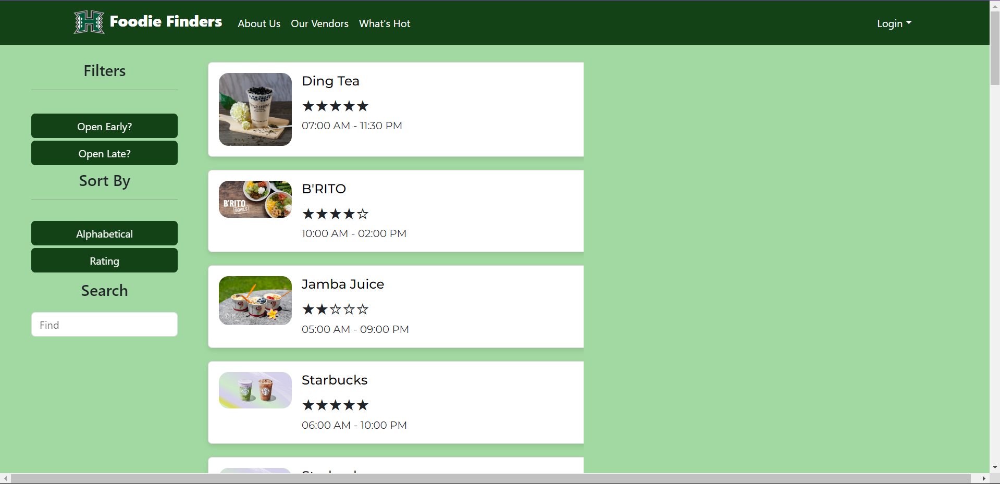
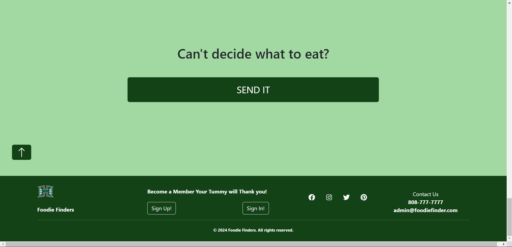
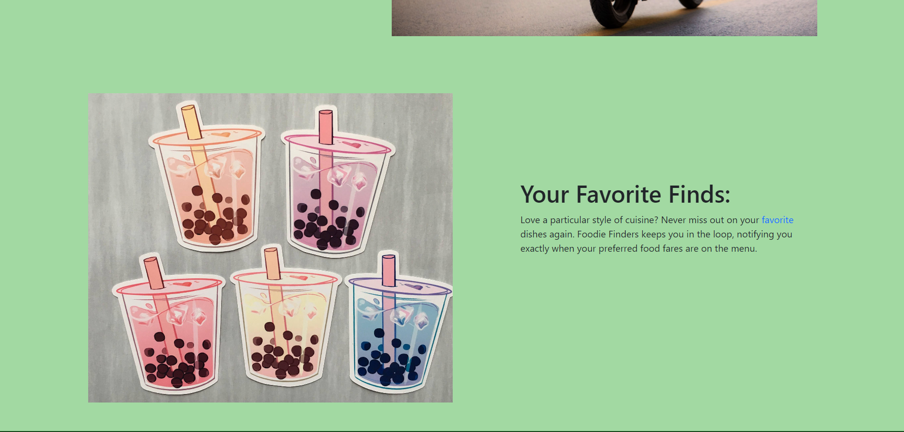

## Overview
Foodie Finders is a website that allows students to find restaurants near the college campus. Students can write reviews for each specific restaurant and leave a rating on them. However, if students want to be able to access these functions, they have to sign up and make an account. 

If a new restaurant pops up near the campus area, they can sign up and make a vendor account. These accounts are granted the ability to be able to make a restaurant show up on the listing. These restaurants include information such as distance, a small picture, and the hours they are open. If a vendor decides to change their hours, there is a quick and easy edit functionality which can be utilized, so as long as that vendor is logged in.

 The layout of my game window is pretty simple when it is run, but the thing I was most proud of was how I basically made it into dark mode. Graphic design is actually NOT my passion so being able to make something that doesn’t look like it comes from a website designed before 2000 was great. Here is the game window:

## My Role
Foodie Finders was a group project for my software engineering class, combining the efforts of 5 people (including me). Each member was assigned or volunteered to undertake a specific part of the website, which includes certain pages or the testing portion.

  
  

My main focus in this project was building the page which is essentially an index of all the restaurants. I split up the page into two different columns, the filters and sorting on the left, and the restaurant "cards" on the middle. For convenience I designed the filter column to be sticky and follow the user as they mindlessly scroll through a seemingly endless amount of options. By the time the user hits the bottom, they snap back to reality and is faced with a big button that will take them to a random restaurant page, since they clearly don't know what to eat. 

Aside from the "Our Vendors" page, I also had a hand in designing the "About Us" page. Drawing inspiration from many different websites, I realized that many of them utilize a lot of space with words that pop up and pictures that capture attention. With each of the key functionalities of the website, I tried to pair it with a relevant image which would make it stand out more, as opposed to just a block of text.
 

    

## Lessons Learned

By undertaking this project, one of the most important things that I learned was how important effective communication was. One instance of this was an incident in which another project member's work completely intersected with mine, which resulted in a lot of time trying to figure out how to merge those two pages together. Another thing was the reinforcement of what I learned. An exmaple of this was making the filters and the sort functionality come to life within the page. This is something that is ubiquitous in websites, but trying to implement it myself was a challenge in itself. Being able to struggle through that one time will serve as a solid foundation in my software developing career.
